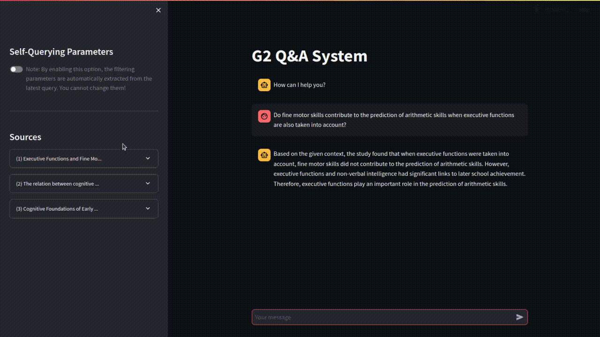

# PubMed_MLP-INLPT-WS2023


<center>Demonstration of the G2 RAG System</center>

## Key Information

**Title**: G2 PubMed RAG-System

**Contributors:**

| User | Name       | Matriculation Number | Email Addresses                               |
|----------|------------------------|----------------------|-----------------------------------------------|
|4kills    | Dominik Ochs           | 4736026              | dominik.ochs@gmx.net                          |
|llambdaa  | Lukas Rapp             | 4736025              | lu.rapp@stud.uni-heidelberg.de                |
|theosth   | Theo Stempel-Hauburger | 4740729              | theo.stempel-hauburger@stud.uni-heidelberg.de |
|BenediktV | Benedikt Vidic         | 4738257              | benedikt.vidic@stud.uni-heidelberg.de         |

We are all enrolled in the Master Data and Computer Science.

**Advisor**: Ashish Chouhan

**Anti-Plagiarism Confirmation**: See file `./plagiarism_declaration_allsigned.pdf`

Please find the project report under `management/docs/DOCUMENTATION.md`.

## Setup project environment

### Ollama

Install Ollama for your OS following the instructions at https://ollama.com/. 
We *STRONGLY* recommend using some kind of acceleration. It is also best to run it *WITHOUT* docker. 
After installation, run 
```sh
ollama pull mistral
ollama serve
```
Tested on MacOS (Metal acceleration) and Ubuntu (NVIDIA graphics card). 

### OpenSearch

On Windows, one can install OpenSearch directly on the system. Keep in mind that this somewhat complicates the insertion of 
the OpenSearch volume found under `data/opensearch`. We have not tested running it bare-bones on Windows. We recommend using docker.

#### Docker

For development purposes, especially for an easy installation of *OpenSearch*, we use *Docker*. 

##### Mac
On Mac, we use *Colima* together with the free-to-use, open-source Docker Engine. When installing *docker-compose* via *brew* remember to symlink it to docker as plugin. The instructions can be found on the brew page.
Furthermore you have to add the following code snippet to your Colima vm configuration (via `colima start --edit`): 
```yaml
provision:
  - mode: system
    script: sysctl -w vm.max_map_count=262144
```  

##### Windows 

On Windows we can recommend using the Docker Engine directly via *WSL2*. You'll likely have to 
add `vm.max_map_count = 262144` to the `/etc/sysctl.conf` of your WSL2 installation to persist the change, 
as well as `sysctl -w vm.max_map_count=262144` to make the initial change. However, we have not tested this, and it might not be necessary.  

For Windows or Mac, one can also use *Docker Desktop* (free for educational use). 

##### Linux

On Linux (tested on Ubuntu), the process should be the same as for Windows WSL2. However, editing the parameters might not be necessary.

#### Index

Process of ingesting and embedding the documents yourself, you can use our pre-packaged OpenSearch index.
To do that, create the folder `data/opensearch` and unpack our `opensearch.zip` into that folder. You can find `opensearch.zip`
here:
```
https://drive.google.com/drive/folders/1RFKnvQT_dRFUv4zJgBV8tarvRsjkxjqL?usp=sharing
```
After unpacking, check if `data/opensearch/nodes` along with other files exists.
The structure of the data folder should look something like this:
```
data
└── opensearch
    └── nodes
        └── 0
    └── batch_metrics_enabled.conf
    └── logging_enabled.conf
    └── ...
```

If you, however, want to ingest the data yourself using `ingestor.py` (takes 3-6 hours without acceleration, 15 min with acceleration), you can do so by just creating `data/opensearch`
and leaving it empty.

In any case, use  `docker compose up` in the base directory to start OpenSearch.

**Manual Index Creation**:  
If you want to create the indices manually, not using our pre-packaged ones, you can use the `development/ingest/abstract_fragment_ingestor.py` and `development/ingest/abstract_ingestor.py` scripts.  
For that, first create a folder `development/ingest/data`, then downloading the `abstract_fragment_dataset.json` and the `abstracts_dataset.json` from the following link:
```
https://drive.google.com/drive/folders/1RFKnvQT_dRFUv4zJgBV8tarvRsjkxjqL?usp=sharing
```
After downloading, place the files in the `development/ingest/data` folder. Then run the `ingestor.py` script.

**Creating the datasets manually**:
If you want to create the datasets manually, first execute the scraper script `development/scrape/pubmed_scraper.py`.
Then execute the extractor that sanitizes the data using the `development/scrape/pubmed_extractor.py` script.
After that, you can execute the scripts `development/ingest/abstracts_dataset_gen.py` and `development/ingest/abstract_fragments_dataset_gen.py` to create the datasets in the folder `development/ingest/data`.


### Python
(tested with Python 3.10.12)

1. Setup a venv with python (or `conda`)
```bash
python -m venv .venv
```

2. Activate venv
```bash
source .venv/bin/activate
```

3. Install requirements from requirements.txt
```bash
pip install -r requirements.txt
```

### Settings

If necessary (for example to adjust your OpenSearch credentials), edit `commons/env.py`. However, if you have set up the project using docker,
this should not be necessary and the defaults in `commons/env.py` should work for you.  
To reproduce some evaluation results, it is necessary to set the `OPENAI_API_KEY` environment variable in the `.env` file to a valid OpenAI API key.


## Troubleshooting

- If you have any trouble with OpenSearch memory or JVM heap size, 
go to the `docker-compose.yml` line 12 and adjust the memory. We tried to use sensible defaults.
- If you have problems with docker, this could be because it is not installed in rootless mode. In this case, you might have to use `sudo docker compose up` instead (not recommended).

## Usage Guide


The *G2 RAG System* is equipped with an interactive interface, as can be seen in our [Demonstration](#pubmed_mlp-inlpt-ws2023).
The interface allows the user to enter a query, for which matching abstracts are searched for by the OpenSe
Filter in OS Connector:  None compared directly to the abstracts in the database.

The retrieval system yields the most relevant abstracts. The sources are listed in a sidebar, consisting of useful
information, such as a PubMed link, the PMID, the title, an author list and a confidence rating. Using the retrieved
context documents and the user query, an LLM produces an answer, which is displayed in the chat window.

For better assessability of the results, we designed the `Confidence Rating`, which is displayed alongside the retrieved
documents. The rating hints the user at how suitable the retriever thinks the returned documents are for answering the
user query. The better and more precise a query is, the better the retrieved documents and their corresponding confidence
ratings tend to be. Poorly asked questions or questions without data basis naturally get a low rating. Hence, the confidence
classifications help the user to assess the quality of the context and answer, as well as to refine the query at hand.

### Run Project
```bash
streamlit run development/website/website.py
```